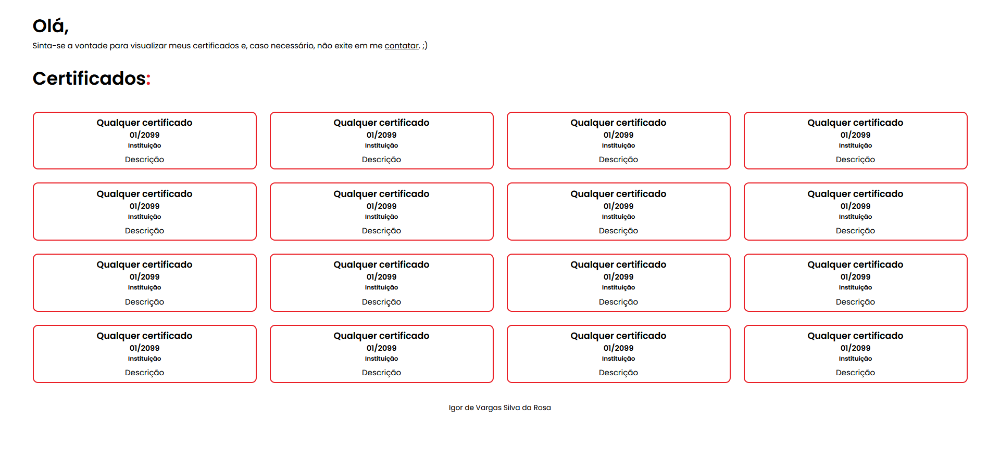

<h1 align="center"> Igor Vargas | Hospedagem de certificados </h1>

Repositório desenvolvido para hospedar certificados.

  <a href="#-tecnologias">Tecnologias</a>&nbsp;&nbsp;&nbsp;|&nbsp;&nbsp;&nbsp;
  <a href="#-projeto">Projeto</a>&nbsp;&nbsp;&nbsp;

 

  

## 🚀 Tecnologias

Esse projeto foi desenvolvido com as seguintes tecnologias:

- HTML e CSS
- Git e Github

## 💻 Projeto

Repositório desenvolvido para hospedar certificados não tão relevantes para determinada vaga aplicada.